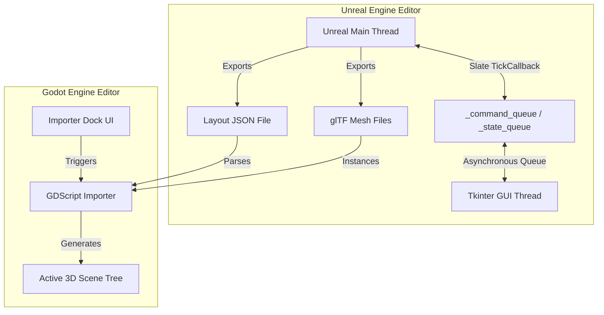

# Technical Brief: Unreal Engine to Godot Exporter

This document provides a detailed technical overview of the architecture, data structures, and mathematical transformations implemented in the Unreal Engine to Godot Exporter.

---

## 1. System Architecture

The pipeline consists of an **Exporter plugin** written in Python for Unreal Engine, and an **Importer addon** written in GDScript for Godot Engine 4.x. Communication between the two environments is facilitated via standard file system exports (glTF for models, JSON for layout descriptions, and standard image formats for textures).



### Thread-Safe GUI Architecture in Unreal Engine
Unreal Engine's Python scripting APIs must be executed strictly on the main game thread. Running a blocking UI framework (like Tkinter's `mainloop()`) directly on the main thread would freeze the editor. To resolve this:
- **Background GUI Thread**: The Tkinter GUI is spawned in a separate daemon thread.
- **Slate Post-Tick Callback**: The plugin registers a callback using `unreal.register_slate_post_tick_callback(check_editor_queues)` which ticks at the end of every editor frame on the game thread.
- **Communication Queues**:
  - `_command_queue`: The Tkinter background thread pushes user actions (e.g., "export layout", "export selected meshes") to this queue. The game thread processes them during the Slate tick.
  - `_state_queue`: The game thread polls the editor state (active level name, asset selection count) and pushes it to this queue. The Tkinter thread reads this queue using `root.after(200, self.poll_state)` to update the GUI labels dynamically.

---

## 2. Coordinate System & Scale Conversion

Unreal Engine and Godot Engine use fundamentally different coordinate systems:
- **Unreal Engine**: Left-handed, Z-up, 1 unit = 1 centimeter.
- **Godot Engine**: Right-handed, Y-up, 1 unit = 1 meter.

### Translation & Scale Conversion
To convert a translation vector from Unreal $(x_u, y_u, z_u)$ in centimeters to Godot $(x_g, y_g, z_g)$ in meters:
- Godot $X$ maps to Unreal $Y$ (scaled by $0.01$).
- Godot $Y$ maps to Unreal $Z$ (scaled by $0.01$).
- Godot $Z$ maps to negative Unreal $X$ (scaled by $0.01$).

$$\begin{bmatrix} x_g \\ y_g \\ z_g \end{bmatrix} = \begin{bmatrix} y_u \cdot 0.01 \\ z_u \cdot 0.01 \\ -x_u \cdot 0.01 \end{bmatrix}$$

For scale vectors, the conversion maps the absolute scale axes directly without scaling:

$$\begin{bmatrix} s_g \\ s_g \\ s_g \end{bmatrix} = \begin{bmatrix} s_{yu} \\ s_{zu} \\ s_{xu} \end{bmatrix}$$

### Rotation Basis Conversion
To convert the 3x3 rotation basis from Unreal to Godot, we use a change-of-basis matrix $C$.

$$C = \begin{bmatrix} 0 & 1 & 0 \\ 0 & 0 & 1 \\ -1 & 0 & 0 \end{bmatrix}$$

Given an Unreal rotation matrix $R_u$:

$$R_u = \begin{bmatrix} r_{00} & r_{01} & r_{02} \\ r_{10} & r_{11} & r_{12} \\ r_{20} & r_{21} & r_{22} \end{bmatrix}$$

The remapped rotation matrix in Godot $R_g$ is:

$$R_g = C R_u C^T$$

Performing the matrix multiplication:

$$R_g = \begin{bmatrix} 0 & 1 & 0 \\ 0 & 0 & 1 \\ -1 & 0 & 0 \end{bmatrix} \begin{bmatrix} r_{00} & r_{01} & r_{02} \\ r_{10} & r_{11} & r_{12} \\ r_{20} & r_{21} & r_{22} \end{bmatrix} \begin{bmatrix} 0 & 0 & -1 \\ 1 & 0 & 0 \\ 0 & 1 & 0 \end{bmatrix}$$

$$R_g = \begin{bmatrix} r_{11} & r_{12} & -r_{10} \\ r_{21} & r_{22} & -r_{20} \\ -r_{01} & -r_{02} & r_{00} \end{bmatrix}$$

This matrix $R_g$ is then converted back to a normalized quaternion $(q_x, q_y, q_z, q_w)$ to construct Godot's `Transform3D` basis.

---

## 3. JSON Layout Schema

The exported level layout JSON file defines a flat database of meshes and a hierarchical list of level actors.

```json
{
    "level_name": "MyLevel",
    "unreal_project_dir": "C:/Projects/UnrealProject/",
    "total_actors": 1,
    "total_mesh_instances": 1,
    "meshes": {
        "SM_Rock_01": {
            "path": "/Game/Environment/SM_Rock_01.SM_Rock_01",
            "collision": {
                "boxes": [
                    {
                        "size": [100.0, 100.0, 100.0],
                        "godot_local_transform": {
                            "translation": [0.0, 0.0, 0.0],
                            "rotation_quat": [0.0, 0.0, 0.0, 1.0],
                            "scale": [1.0, 1.0, 1.0]
                        }
                    }
                ],
                "spheres": [],
                "capsules": [],
                "convex_hulls": []
            },
            "materials": [
                {
                    "slot_index": 0,
                    "slot_name": "M_Rock",
                    "material_name": "MI_Rock_01",
                    "material_path": "/Game/Environment/MI_Rock_01.MI_Rock_01",
                    "parameters": {
                        "albedo_color": [1.0, 1.0, 1.0, 1.0],
                        "roughness": 0.6,
                        "metallic": 0.0,
                        "albedo_texture": "T_Rock_Albedo",
                        "normal_texture": "T_Rock_Normal",
                        "roughness_texture": "T_Rock_Roughness",
                        "metallic_texture": null,
                        "tiling": [1.0, 1.0]
                    }
                }
            ]
        }
    },
    "actors": [
        {
            "name": "Rock_Actor_01",
            "class": "StaticMeshActor",
            "unreal_transform": {
                "translation": [100.0, 200.0, 300.0],
                "rotation_quat": [0.0, 0.0, 0.0, 1.0],
                "rotation_euler": [0.0, 0.0, 0.0],
                "scale": [1.0, 1.0, 1.0]
            },
            "godot_transform": {
                "translation": [2.0, 3.0, -1.0],
                "rotation_quat": [0.0, 0.0, 0.0, 1.0],
                "scale": [1.0, 1.0, 1.0]
            },
            "components": [
                {
                    "name": "StaticMeshComponent_0",
                    "mesh_name": "SM_Rock_01",
                    "mesh_path": "/Game/Environment/SM_Rock_01.SM_Rock_01",
                    "unreal_relative_transform": { ... },
                    "godot_relative_transform": { ... },
                    "unreal_world_transform": { ... },
                    "godot_world_transform": { ... },
                    "material_overrides": []
                }
            ]
        }
    ]
}
```

---

## 4. Import & Generation Workflows (Godot Side)

When running the import task, the GDScript compiler walks the JSON file and reconstructs the actor hierarchy:

1. **Instancing Logic**:
   - Every mesh actor is parented under one `UnrealStaticMeshes` node, alongside the `UnrealLights` / `UnrealDecals` / `UnrealFoliage` / `UnrealNavigation` containers the feature modules build. A level is overwhelmingly static meshes; loose at the scene root they bury everything else in the outliner. The container sits at identity, so nothing below it moves.
   - If an actor contains exactly **one** mesh component, the importer directly instances the glTF model and places it at the actor's world transform.
   - If an actor contains **multiple** components (e.g., Blueprint assets), the importer creates a root `Node3D` (named after the actor) and attaches the individual component models at their relative transforms.
2. **Physics Auto-Generation**:
   - If collision primitive data is present in the `meshes` library for a given mesh, a `StaticBody3D` node is created as the parent, and `CollisionShape3D` nodes are added for each primitive.
   - **Capsule Height Conversion**: Godot capsule heights are defined as total height (including spherical caps), whereas Unreal uses cylinder length. The height is converted via $H_g = (L_{cylinder} + 2R) \cdot 0.01$.
   - **Non-uniform scale is baked into the shapes, never left on the body.** Jolt cannot apply a non-uniform (or mirrored) scale to a sphere or capsule, nor to a rotated box or hull. It does not fail loudly: it substitutes the arithmetic *mean* of the three axes and logs one error per body on every scene load, leaving each collider a few percent off the mesh it was exported to hug. Unreal level designers scale props non-uniformly routinely, so the importer strips that scale off the `StaticBody3D` (and off a Blueprint's parent `Node3D`, whose scale the bodies would otherwise inherit) and folds it into the shapes: hulls take it exactly, per vertex, via $B^{-1}SB$; a box scales its extents along its own axes; a capsule splits it into axial (Y) and radial (X/Z) factors; a sphere can only take the mean. The mesh instance under the body picks up the same scale so the prop still renders unchanged. Uniformly scaled props take none of this and are emitted exactly as before. Shared helpers live in `import_common.gd` (`physics_body_transform` and friends), mirrored in `tscn_writer.py`.
3. **Material Assignment**:
   - Compiles default materials and component-level material overrides.
   - Generates a `StandardMaterial3D` for each unique material name, mapping color and scalar parameter overrides.
   - Searches the designated Textures directory for files matching the Unreal texture parameter names with common image extensions (`.png`, `.tga`, `.jpg`, `.jpeg`, `.dds`, `.exr`, `.webp`), case-insensitively.
   - Uses a caching dictionary (`material_cache`) to reuse material resources across multiple actors, avoiding resource duplication.

---

## 5. Schema v2: Modular Feature Pipeline

Version 2 extends the layout JSON with lights, post-processing, height fog, sky, decals, landscapes (heightmap/splatmap EXR files), packed foliage instances, navigation volumes, and per-actor tags/metadata. Every feature is an isolated module pair:

| Feature | Unreal exporter | Godot importer |
|---|---|---|
| Lights / post-fx / fog / sky / decals | `export_environment.py` | `import_environment.gd` |
| Landscape terrain | `export_landscape.py` | `import_terrain.gd` |
| Foliage / ISM / HISM | `export_foliage.py` | `import_foliage.gd` |
| Navigation + metadata | `export_gameplay.py` | `import_gameplay.gd` |
| Direct `.tscn` generation | `tscn_writer.py` | — (plus a dock utility to bind foliage meshes) |

Shared conversion math lives in `ue2g_common.py` (Python) and `import_common.gd` (GDScript). The orchestrators (`export_level_to_json.py`, `import_unreal_layout.gd`) load feature modules defensively — a missing module simply disables its feature. The full JSON schema and module contracts are specified in [docs/SCHEMA_V2.md](docs/SCHEMA_V2.md).

Two reliability guarantees added in v2 for large asset packs:
- **Collision-safe export names**: when two different mesh assets share a name, both exports get a deterministic `_<8-char-path-hash>` suffix (`meshes` library keys, glTF filenames, and component `mesh_key` references all stay consistent).
- **Instanced-mesh routing**: `InstancedStaticMeshComponent` (including HISM and painted foliage) components are excluded from per-component actor export and instead exported as packed 12-float-per-instance transform arrays, rebuilt as `MultiMeshInstance3D`.
